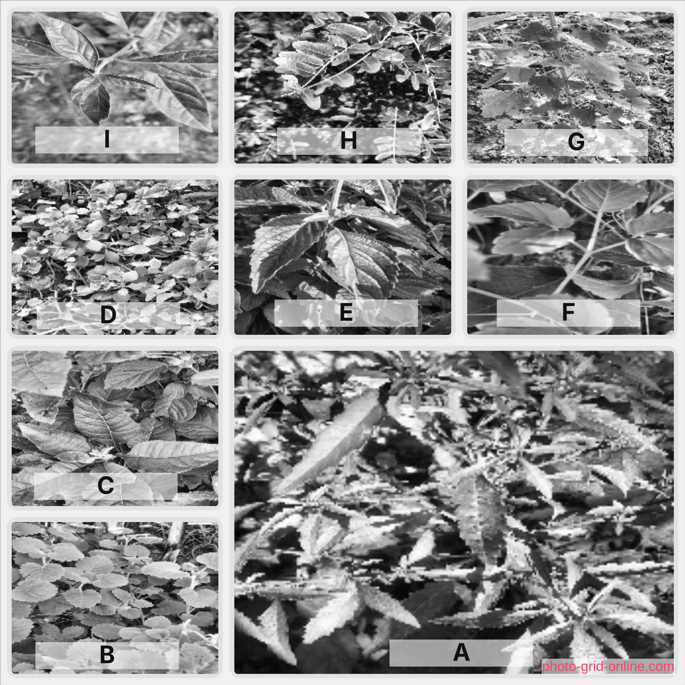

# Comparative Evaluation of ORB-Based Bag-of-Visual-Words, Convolutional Neural Networks, and Transfer Learning for Herbal Plant Recognition

<a href="./report/main.pdf">Report</a> · <a href="./slides/main.pdf">Slides</a> · <a href="https://www.kaggle.com/datasets/henrysml/herbal-plants-under-diverse-conditions">Dataset</a>  

### Project setup

> only for linux/mac

1. Install python 3
2. create virtual environment
3. install dependencies
4. run training notebook

### Slides

> See [slides/README.md](./slides/README.md)

### Report

> See [report/README.md](./report/README.md)
